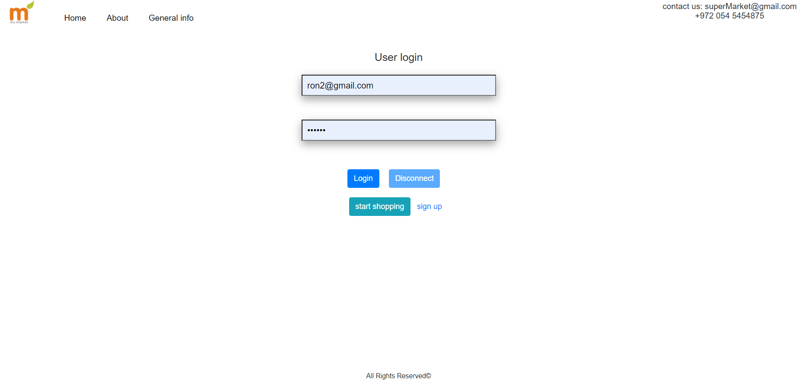
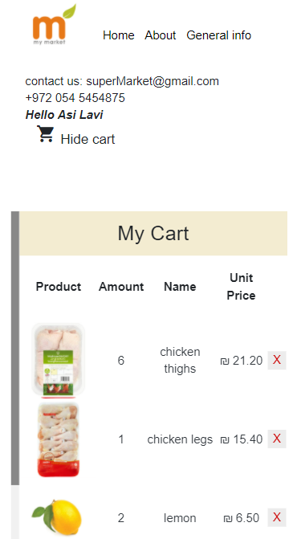
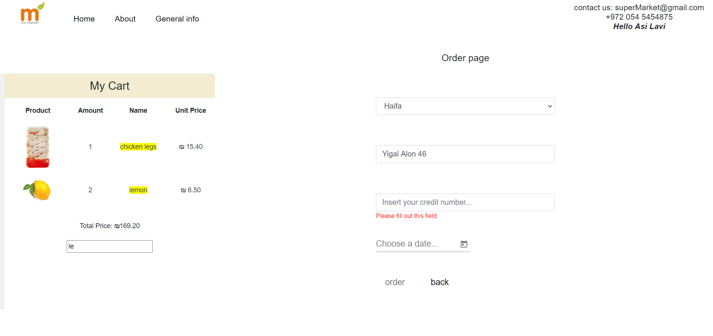
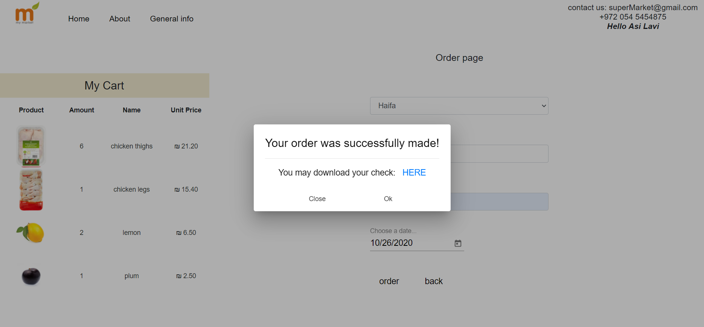
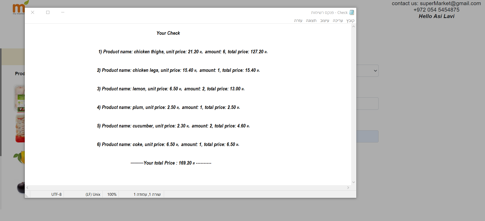
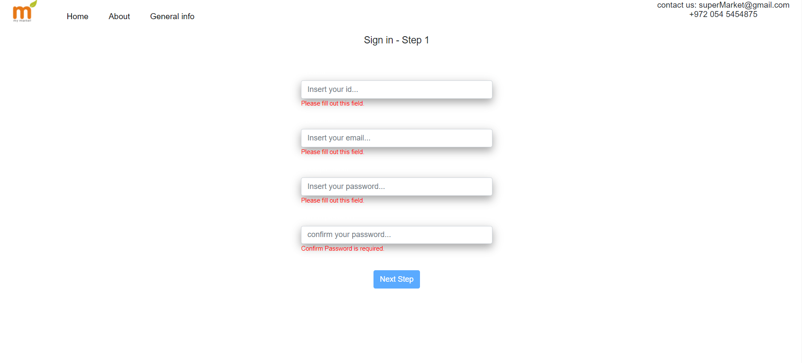
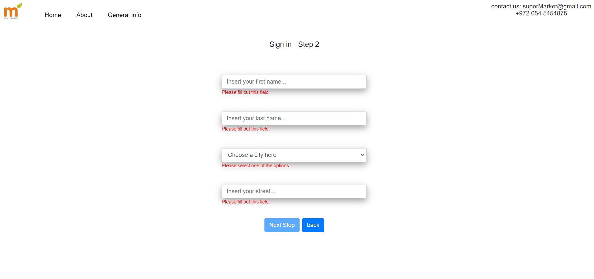
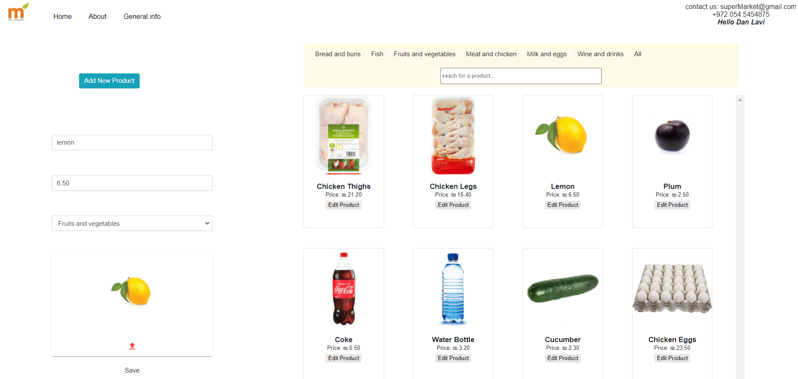

# Online Store

Online Store SPA for selling groceries using Angular & Node.JS.

## Topics:

* HTML + CSS
  - HTML5 Structure
  - Bootstrap design
  
* Angular

* NodeJS
  - Using express
  - Restfull App
  
* MySQL
  - Design & create schema
  - Queries

***

### Home Page:

***

### Mobile Friendly:

***

### Shoppping cart and Products:
* The cart can be shown or hidden

***

### Order Page:
* Note that just for demonstration - only 3 orders are allowed per day.

***

### Order Successfully Completed:

***

### Receipt:
* The customer recieves a receipt as a text file.

***

### Register Step One:

***

### Register Step Two:

***

### Admin Panel:
* You can edit a product or add a new one.

